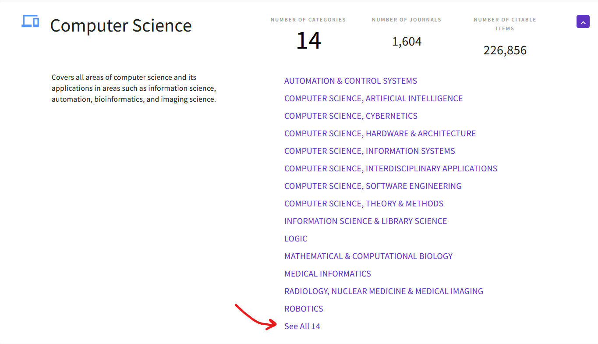
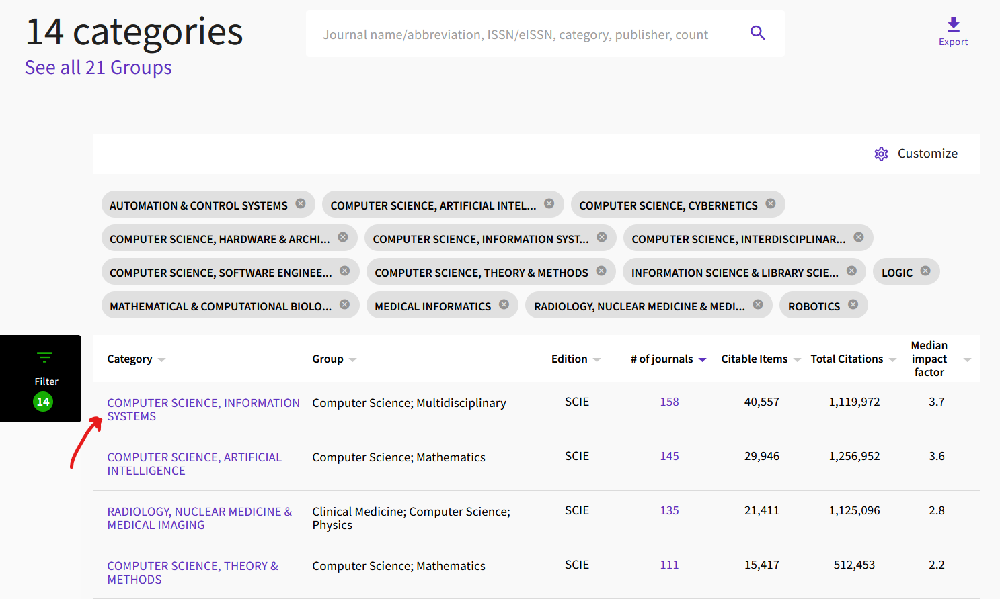
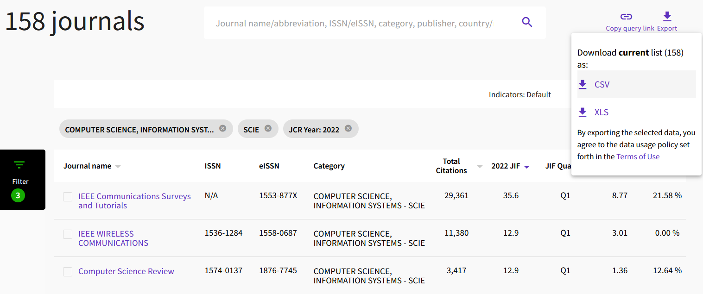

# Computer Science Journal Analysis Toolkit

This repository contains R scripts and instructions to replicate the analysis of 
computer science journals from different sources presented at the GRIN annual general 
meeting held in Rome on December 12, 2023.

The accompanying slide deck for this repository is available in PDF format within the 
repository under the filename [`computer-science-journals-presentation.pdf`](./computer-science-journals-presentation.pdf).

Currently, **5 sources** are considered in the analysis:
* [Scopus](https://www.scimagojr.com/journalrank.php)
* [Clarivate's Web of Science (WoS) - Computer Science Group](https://jcr.clarivate.com/jcr/browse-categories)
* [GEV01 List for VQR 2015-2019](https://www.anvur.it/attivita/vqr/vqr-2015-2019/gev/area-1-scienze-matematiche-e-informatiche/)
* [CORE Journal List](http://portal.core.edu.au/jnl-ranks/?search=&by=all&source=CORE2020&sort=atitle&page=1)
* [DBLP Computer Science Journals](https://dblp.org/db/journals/index.html)

## Replication Instructions

### 0. Prerequisites
This toolkit has been developed and tested using R 4.3.0 and the PyCharm IDE. 
RStudio should work out of the box as well.

### 1. Data Preparation
Before performing the analysis, it is necessary to download raw data from the considered 
sources. Due to Intellectual Property concerns, raw data from Scopus, WoS, CORE and DBLP 
are not included in this repository and need to be downloaded manually as instructed below.

#### 1.1 Scopus
Visit the [Scimago Journal Rank website](https://www.scimagojr.com/journalrank.php), select "Journals" 
as the entry type from the dropdown menu on top, and click on the "Download data" button 
in the upper-right part of the web page.
A download for a CSV file (e.g.: `scimagojr 2022.csv`) should automatically start.
Download the file and place it in the `./raw_data/` directory.

#### 1.2 Web of Science
Visit the [WoS Journal Citation Reports web page](https://jcr.clarivate.com/jcr/browse-categories),
click on the Computer Science group, and then click on "See All 14" to access a page listing
all categories in the Computer Science group (as shown in the screen capture below).

Subsequently, for each of the 28 categories (each of the 14 categories comes in two editions, 
e.g., SCIE, ESCI), open the category page by clicking on the category name.

In the category detail page, click on the "Export" link in the upper-right part of the web
page to download, and then select the CSV download option, as shown in the screen capture below.
Note that it is necessary to be logged in with a Clarivate account to download the data.

Repeat the above process for each of the 28 categories, and place the downloaded CSV files
in the `./raw_data/clarivate/` directory.

#### 1.3 CORE
Visit the [CORE Journal Ranks page](http://portal.core.edu.au/jnl-ranks/?search=&by=all&source=CORE2020&sort=atitle&page=1)
and click on the "Export" button placed in the upper-right corner of the table.
This will trigger the download of a `CORE_journals.csv` file.
Place the downloaded file in the `./raw_data/` directory.

#### 1.4 GEV01 List of Journals for VQR 2015-2019
The GEV01 List of Journals for VQR 2015-2019 is already included in the repository
in the `./raw_data/GEV/Elenco INF01 - Informatica.xlsx` file, 
thus no additional step is needed. Data can be downloaded from [this link](https://www.anvur.it/attivita/vqr/vqr-2015-2019/gev/area-1-scienze-matematiche-e-informatiche/).

#### 1.5 DBLP
Data from DBLP is scraped from the DBLP website. To automatically scrape DBLP Journal 
data, run the `./raw_data/scrape_dblp_journals.R` script.
The script will generate a `./raw_data/dblp_journals.csv` file containing all journals 
listed on the DBLP website. Note that the scraping scripts takes approximately 45 minutes to run,
due to limitations on the number of connections accepted by the DBLP website.

### 2. Data Pre-processing
With all the raw data in place, the next step is data pre-processing.
To this end, it is necessary to run the following scripts.

#### 2.1 WoS
This step is performed by the `00a_process_clarivate.R` script. 
This scripts merges the CSV files for each category into a single dataset, 
which is saved in the `./data/clarivate.RDS` file.
Before running the script, make sure that the `clarivateDataPath` variable in 
Line 8 is properly initialized with the correct path in which you downloaded the CSV
files from WoS.

#### 2.2 Scopus
This step is performed by the `00b_process_scimago.R` script. 
This scripts does some pre-processing and normalization on ISSNs, and saves 
processed data in two separate files:
* `./data/scimago.RDS`, containing the entire Scopus journal list, and
* `./data/scimago_CS.RDS`, containing the subset of journals that are classified in 
the Computer Science Area in Scopus.

Before running the script, make sure that on **Line 4** the correct path to the CSV file
you downloaded is provided.

#### 2.3 CORE
This step is performed by the `00c_process_core.R` script. 
This scripts processes raw data from CORE, and saves pre-processed data in 
the `./data/core.RDS` file.
Before running the script, make sure that on **Line 4** the correct path to the CSV file
you downloaded is provided.

#### 2.4 GEV
This step is performed by the `00d_process_gev.R` script. 
This scripts processes raw data from GEV, 
and saves pre-processed data in the `./data/gev.RDS` file.
Before running the script, make sure that on **Line 3** the correct path to the xlsx file
you downloaded is provided.

#### 2.5 DBLP
This step is performed by the `00e_process_dblp.R` script. 
This scripts processes raw data from GEV, 
and saves pre-processed data in the `./data/dblp.RDS` file.
Before running the script, make sure that on **Line 5** the correct path to the CSV file
you downloaded is provided.

### 3. JOINING DATA
At this point, the `./data/` directory should contain the following pre-processed files:
* `./data/clarivate.RDS`;
* `./data/scimago.RDS` and `./data/scimago_CS.RDS`;
* `./data/core.RDS`
* `./data/gev.RDS`
* `./data/dblp.RDS`

To join the data, run the following scripts in order:

1. `01a_join_data.R`. This script takes ~1 minute to perform the join, and creates the following files:
   * `./data_joined/scimago.RDS` and `./data_joined/scimago_all.RDS`
   * `./data_joined/clarivate.RDS`
   * `./data_joined/core.RDS`
   * `./data_joined/gev.RDS`
   * `./data_joined/dblp.RDS`
   
   These files contain the original data from each source, in which the titles of the
   journals are normalized (i.e.: a journal appearing in multiple source, has the same
   title in each of them). Moreover, an additional file containing  all joined data is generated
   * `./data_joined/full_outer_join.RDS`

2. `01b_prepare_joined_dataset.R`. This script reads the `./data_joined/all_outer_join.RDS`
file generated by the previous script and creates an XLSX and a JSON file containing the final 
dataset. These files are saved in:
   * `./data_joined/dataset.xlsx`
   * `./data_joined/dataset.json`

### 4. Analysis and Visualization
To generate the Venn diagrams and the Upset plots representing the intersections between
the considered sources, run the `02a_analysis.R` script.
The plots will be saved in the `./visualizations` directory.
To perform the pairwise analysis between the considered sources and generate 
area-proportional Euler diagrams, run the `02b_euler.R` script.
